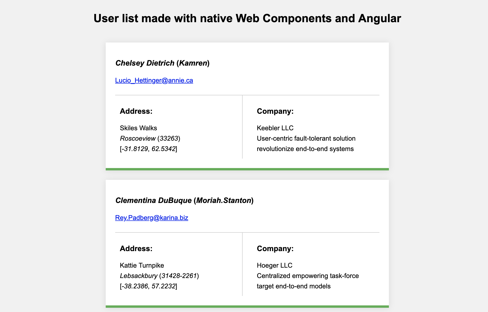

# User List Webcomponent Angular

This simple app shows a list of users and for this it is based on the native specification of Web Components of the browser and as a framework uses Angular.



## Getting started

* Install `node.js`
* Install Angular CLI:
```javascript
npm install -g @angular/cli
````
* Install project dependencies. Go to the root project `$/user-list-webcomponent-angular` and run:
```javascript
npm i
````
* Install `static-server` module:
```javascript
npm -g install static-server
````

## Development server

Run `ng serve` for a dev server. Navigate to `http://localhost:4200/`.

## Production server

Run `ng build --prod` to build the project:

```javascript
ng build
````

Go to the `dist` project `$/dist/user-list-webcomponent-angular/` and run:

```javascript
static-server --port 4200
````

Navigate to `http://localhost:4200/`.

## Running unit tests

Run `ng test` to execute the unit tests via [Karma](https://karma-runner.github.io).

## Running end-to-end tests

Run `ng e2e` to execute the end-to-end tests via [Protractor](http://www.protractortest.org/).